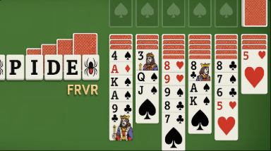

# 🎮 Open Source H5 Spiele Sammlung

*🌍 Languages: [English](README.md) | [中文简体](README-zh.md) | [日本語](README-ja.md) | **Deutsch** | [Français](README-fr.md)*

<!-- Sprachenwechsel-Script -->
```javascript
function switchLanguage(lang) {
    const languageFiles = {
        'en': 'README.md',
        'zh': 'README-zh.md',
        'ja': 'README-ja.md',
        'de': 'README-de.md',
        'fr': 'README-fr.md'
    };
    if (languageFiles[lang]) {
        window.location.href = languageFiles[lang];
    }
}
```

<!-- Statistik-Zähler -->
<div align="center">
    
    
    
</div>

---

## 📊 Statistiken

- **Gesamtanzahl Spiele**: 22
- **Spiele-Kategorien**: Puzzle, Aktion, Arcade, Strategie
- **Unterstützte Sprachen**: 5
- **Sofort spielbereit**: ✅ Alle Spiele

---

Willkommen zu unserer Sammlung von Open-Source-HTML5-Spielen! Jedes Spiel kann direkt in Ihrem Browser ausgeführt werden und wird mit vollständigem Quellcode geliefert.

### 🎯 Spieleliste

| Spiel | Logo | Online Spielen | Kategorie |
|-------|------|----------------|-----------|
| [2048](./2048/) |  | [Jetzt Spielen](https://cubes-2048.io/games/2048) | Puzzle |
| [2048 Multitask](./2048-Multitask/) |  | [Jetzt Spielen](https://cubes-2048.io/games/2048-Multitask) | Puzzle |
| [Würfel 2048](./cubes-2048/) |  | [Jetzt Spielen](https://cubes-2048.io/games/cubes-2048) | Puzzle |
| [Cupcake 2048](./Cupcake-2048/) |  | [Jetzt Spielen](https://cubes-2048.io/games/Cupcake-2048) | Puzzle |
| [Doge 2048](./Doge-2048/) |  | [Jetzt Spielen](https://cubes-2048.io/games/Doge-2048) | Puzzle |
| [Fahren Verrückt](./Drive-Mad/) |  | [Jetzt Spielen](https://cubes-2048.io/games/Drive-Mad) | Aktion |
| [Edge Surf](./Edge-Surf/) |  | [Jetzt Spielen](https://cubes-2048.io/games/Edge-Surf) | Aktion |
| [Eggy Car](./Eggy-Car/) |  | [Jetzt Spielen](https://cubes-2048.io/games/Eggy-Car) | Aktion |
| [Faire Quadrate](./Fair-Squares/) |  | [Jetzt Spielen](https://cubes-2048.io/games/Fair-Squares) | Puzzle |
| [Schicke Hosen Abenteuer](./Fancy-Pants-Adventures/) |  | [Jetzt Spielen](https://cubes-2048.io/games/Fancy-Pants-Adventures) | Aktion |
| [Fantasy Dash](./Fantasy-Dash/) |  | [Jetzt Spielen](https://cubes-2048.io/games/Fantasy-Dash) | Aktion |
| [Flappy Bird](./Flappy-Bird/) |  | [Jetzt Spielen](https://cubes-2048.io/games/Flappy-Bird) | Arcade |
| [Flappy Bird (Alternative)](./FlappyBird/) |  | [Jetzt Spielen](https://cubes-2048.io/games/FlappyBird) | Arcade |
| [Flash Tetris](./Flash-Tetris/) |  | [Jetzt Spielen](https://cubes-2048.io/games/Flash-Tetris) | Puzzle |
| [Spiel im Spiel](./Game-Inside/) |  | [Jetzt Spielen](https://cubes-2048.io/games/Game-Inside) | Arcade |
| [Geo Dash](./GeoDash/) |  | [Jetzt Spielen](https://cubes-2048.io/games/GeoDash) | Aktion |
| [Gute Nacht](./Goodnight/) |  | [Jetzt Spielen](https://cubes-2048.io/games/Goodnight) | Arcade |
| [Meme 2048](./Meme-2048/) |  | [Jetzt Spielen](https://cubes-2048.io/games/Meme-2048) | Puzzle |
| [Poly Track](./polytrack/) |  | [Jetzt Spielen](https://cubes-2048.io/games/polytrack) | Aktion |
| [Slice Master](./slicemaster/) |  | [Jetzt Spielen](https://cubes-2048.io/games/slicemaster) | Arcade |
| [Spider FRVR](./spiderfrvr/) |  | [Jetzt Spielen](https://cubes-2048.io/games/spiderfrvr) | Strategie |
| [UNO Online](./unoonline/) |  | [Jetzt Spielen](https://cubes-2048.io/games/unoonline) | Strategie |

### 🚀 Erste Schritte

1. **Klonen Sie dieses Repository**
   ```bash
   git clone https://github.com/ailingqu/h5games.git
   ```

2. **Navigieren Sie zu einem beliebigen Spielverzeichnis**
   ```bash
   cd h5games/[Spiel-Name]
   ```

3. **Führen Sie das Spiel aus** (Wählen Sie eine der folgenden Methoden):

   **Methode 1: Direkt im Browser öffnen (Einfache Spiele)**
   ```bash
   # Für einfache Spiele, die keine Web-Umgebung benötigen
   open index.html
   ```

   **Methode 2: Lokalen Webserver starten (Empfohlen)**
   ```bash
   # Mit Python (Python 3)
   python -m http.server 8000
   # Dann öffnen Sie http://localhost:8000 in Ihrem Browser
   
   # Mit Python (Python 2)
   python -m SimpleHTTPServer 8000
   
   # Mit Node.js (falls npx installiert ist)
   npx http-server -p 8000
   
   # Mit PHP (falls PHP installiert ist)
   php -S localhost:8000
   ```

   **Methode 3: Live Server (VS Code Erweiterung)**
   ```bash
   # Live Server Erweiterung in VS Code installieren
   # Rechtsklick auf index.html und "Open with Live Server" wählen
   ```

4. **Fangen Sie an zu spielen!**

> **⚠️ Wichtig**: Einige Spiele benötigen aufgrund von CORS-Beschränkungen oder Datei-Lading-Anforderungen eine Webserver-Umgebung. Wenn ein Spiel nicht funktioniert, wenn Sie index.html direkt öffnen, verwenden Sie bitte Methode 2 oder 3 oben.

### 💻 Entwicklung

Jedes Spiel enthält:
- ✅ Vollständigen HTML5-Quellcode
- ✅ CSS-Styling-Dateien
- ✅ JavaScript-Spiellogik
- ✅ Assets und Ressourcen
- ✅ Sofort einsatzbereite Konfiguration

### 📈 Analytik

<!-- Spiel-Analytik -->
```javascript
// Spiel-Klick-Verfolgung
function trackGameClick(gameName) {
    if (typeof gtag !== 'undefined') {
        gtag('event', 'game_click', {
            'game_name': gameName,
            'event_category': 'games',
            'event_label': gameName
        });
    }
}

// Sprachenwechsel-Verfolgung
function trackLanguageSwitch(language) {
    if (typeof gtag !== 'undefined') {
        gtag('event', 'language_switch', {
            'language': language,
            'event_category': 'navigation',
            'event_label': language
        });
    }
}
```

### 📜 Lizenz

Alle Spiele sind Open Source und für Bildungs- und Privatzwecke verfügbar. Bitte überprüfen Sie die einzelnen Spielverzeichnisse für spezifische Lizenzinformationen.

### 🤝 Mitwirkung

Wir freuen uns über Beiträge! Bitte zögern Sie nicht:
- 🐛 Fehler zu melden
- 💡 Neue Funktionen vorschlagen
- 🎮 Neue Spiele hinzufügen
- 🌍 Übersetzungen zu verbessern
- 📚 Dokumentation zu erweitern

### 📞 Support

Wenn Sie Probleme haben oder Fragen haben, [erstellen Sie bitte ein Issue](https://github.com/ailingqu/h5games/issues) auf GitHub.

### ⚠️ Urheberrechtshinweis

Alle Spiele in dieser Sammlung wurden aus dem Internet für Bildungs- und Unterhaltungszwecke gesammelt. Wenn Sie der Urheberrechtsinhaber eines Spiels sind und dessen Entfernung wünschen, kontaktieren Sie uns bitte und wir werden es sofort entfernen.

---

<div align="center">
    <strong>⭐ Wenn Ihnen dieses Projekt gefällt, geben Sie uns bitte einen Stern! ⭐</strong>
    <br><br>
    <strong>🎮 Viel Spaß beim Spielen! 🎮</strong>
</div> 