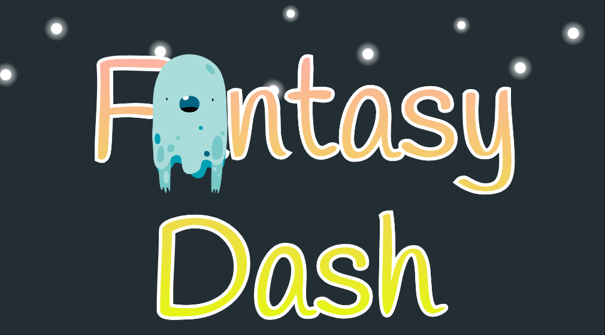
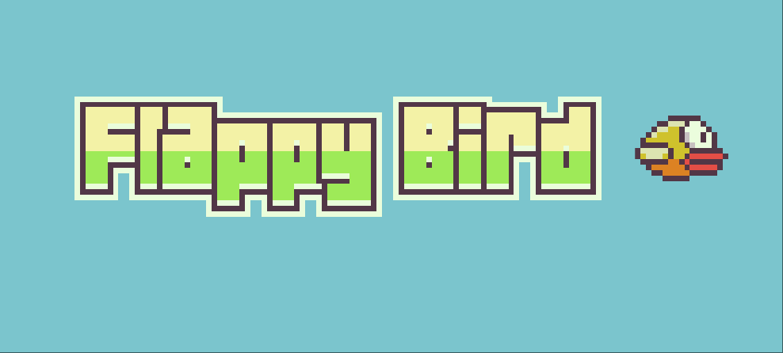
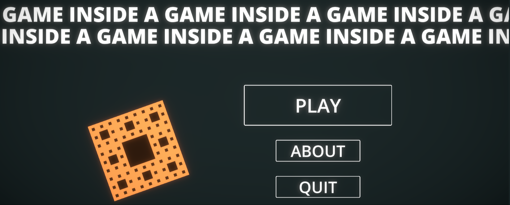
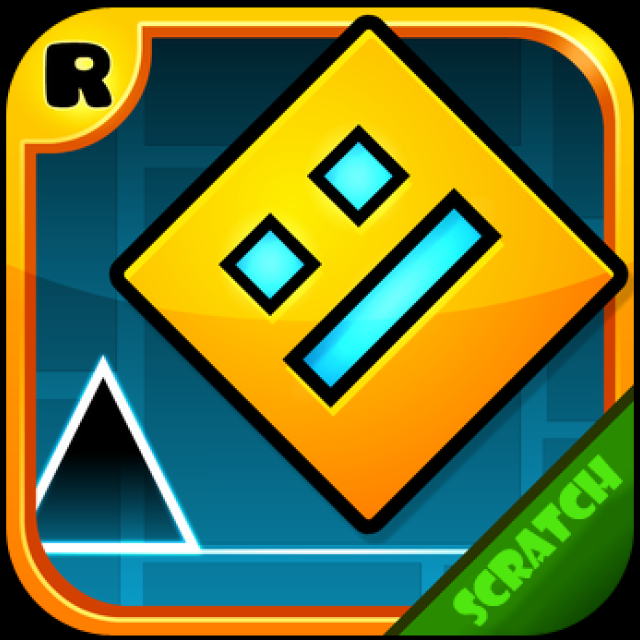

# 🎮 Open Source H5 Spiele Sammlung

*🌍 Languages: [English](README.md) | [中文简体](README-zh.md) | [日本語](README-ja.md) | **Deutsch** | [Français](README-fr.md)*

<!-- Sprachenwechsel-Script -->
<script>
function switchLanguage(lang) {
    const languageFiles = {
        'en': 'README.md',
        'zh': 'README-zh.md',
        'ja': 'README-ja.md',
        'de': 'README-de.md',
        'fr': 'README-fr.md'
    };
    if (languageFiles[lang]) {
        window.location.href = languageFiles[lang];
    }
}
</script>

<!-- Statistik-Zähler -->
<div align="center">
    
    
    
</div>

---

## 📊 Statistiken

- **Gesamtanzahl Spiele**: 22
- **Spiele-Kategorien**: Puzzle, Aktion, Arcade, Strategie
- **Unterstützte Sprachen**: 5
- **Sofort spielbereit**: ✅ Alle Spiele

---

Willkommen zu unserer Sammlung von Open-Source-HTML5-Spielen! Jedes Spiel kann direkt in Ihrem Browser ausgeführt werden und wird mit vollständigem Quellcode geliefert.

### 🎯 Spieleliste

| Spiel | Logo | Online Spielen | Kategorie |
|-------|------|----------------|-----------|
| 2048 |  | [Jetzt Spielen](https://cubes-2048.io/games/2048) | Puzzle |
| 2048 Multitask |  | [Jetzt Spielen](https://cubes-2048.io/games/2048-multitask) | Puzzle |
| Würfel 2048 |  | [Jetzt Spielen](https://cubes-2048.io/games/cubes-2048) | Puzzle |
| Cupcake 2048 |  | [Jetzt Spielen](https://cubes-2048.io/games/cupcake2048) | Puzzle |
| Doge 2048 |  | [Jetzt Spielen](https://cubes-2048.io/games/doge2048) | Puzzle |
| Fahren Verrückt |  | [Jetzt Spielen](https://cubes-2048.io/games/drive-mad) | Aktion |
| Edge Surf |  | [Jetzt Spielen](https://cubes-2048.io/games/edge-surf) | Aktion |
| Eggy Car |  | [Jetzt Spielen](https://cubes-2048.io/games/eggycar) | Aktion |
| Faire Quadrate |  | [Jetzt Spielen](https://cubes-2048.io/games/fairsquares) | Puzzle |
| Schicke Hosen Abenteuer |  | [Jetzt Spielen](https://cubes-2048.io/games/fancypantsadventures) | Aktion |
| Fantasy Dash |  | [Jetzt Spielen](https://cubes-2048.io/games/fantasy-dash) | Aktion |
| Flappy Bird |  | [Jetzt Spielen](https://cubes-2048.io/games/flappy-bird) | Arcade |
| Flappy Bird (Alternative) |  | [Jetzt Spielen](https://cubes-2048.io/games/flappybird) | Arcade |
| Flash Tetris |  | [Jetzt Spielen](https://cubes-2048.io/games/flashtetris) | Puzzle |
| Spiel im Spiel |  | [Jetzt Spielen](https://cubes-2048.io/games/game-inside) | Arcade |
| Geo Dash |  | [Jetzt Spielen](https://cubes-2048.io/games/geodash) | Aktion |
| Gute Nacht |  | [Jetzt Spielen](https://cubes-2048.io/games/goodnight) | Arcade |
| Meme 2048 |  | [Jetzt Spielen](https://cubes-2048.io/games/meme2048) | Puzzle |
| Poly Track |  | [Jetzt Spielen](https://cubes-2048.io/games/polytrack) | Aktion |
| Slice Master |  | [Jetzt Spielen](https://cubes-2048.io/games/slice-master) | Arcade |
| Spider FRVR |  | [Jetzt Spielen](https://cubes-2048.io/games/spiderfrvr) | Strategie |
| UNO Online |  | [Jetzt Spielen](https://cubes-2048.io/games/uno-online) | Strategie |

### 🚀 Erste Schritte

1. **Klonen Sie dieses Repository**
   ```bash
   git clone https://github.com/ailingqu/h5games.git
   ```

2. **Navigieren Sie zu einem beliebigen Spielverzeichnis**
   ```bash
   cd h5games/[Spiel-Name]
   ```

3. **Öffnen Sie die Datei `index.html` in Ihrem Browser**
   ```bash
   open index.html
   ```

4. **Fangen Sie an zu spielen!**

### 💻 Entwicklung

Jedes Spiel enthält:
- ✅ Vollständigen HTML5-Quellcode
- ✅ CSS-Styling-Dateien
- ✅ JavaScript-Spiellogik
- ✅ Assets und Ressourcen
- ✅ Sofort einsatzbereite Konfiguration

### 📈 Analytik

<!-- Spiel-Analytik -->
<script>
// Spiel-Klick-Verfolgung
function trackGameClick(gameName) {
    if (typeof gtag !== 'undefined') {
        gtag('event', 'game_click', {
            'game_name': gameName,
            'event_category': 'games',
            'event_label': gameName
        });
    }
}

// Sprachenwechsel-Verfolgung
function trackLanguageSwitch(language) {
    if (typeof gtag !== 'undefined') {
        gtag('event', 'language_switch', {
            'language': language,
            'event_category': 'navigation',
            'event_label': language
        });
    }
}
</script>

### 📜 Lizenz

Alle Spiele sind Open Source und für Bildungs- und Privatzwecke verfügbar. Bitte überprüfen Sie die einzelnen Spielverzeichnisse für spezifische Lizenzinformationen.

### 🤝 Mitwirkung

Wir freuen uns über Beiträge! Bitte zögern Sie nicht:
- 🐛 Fehler zu melden
- 💡 Neue Funktionen vorschlagen
- 🎮 Neue Spiele hinzufügen
- 🌍 Übersetzungen zu verbessern
- 📚 Dokumentation zu erweitern

### 📞 Support

Wenn Sie Probleme haben oder Fragen haben, [erstellen Sie bitte ein Issue](https://github.com/ailingqu/h5games/issues) auf GitHub.

### ⚠️ Urheberrechtshinweis

Alle Spiele in dieser Sammlung wurden aus dem Internet für Bildungs- und Unterhaltungszwecke gesammelt. Wenn Sie der Urheberrechtsinhaber eines Spiels sind und dessen Entfernung wünschen, kontaktieren Sie uns bitte und wir werden es sofort entfernen.

---

<div align="center">
    <strong>⭐ Wenn Ihnen dieses Projekt gefällt, geben Sie uns bitte einen Stern! ⭐</strong>
    <br><br>
    <strong>🎮 Viel Spaß beim Spielen! 🎮</strong>
</div> 