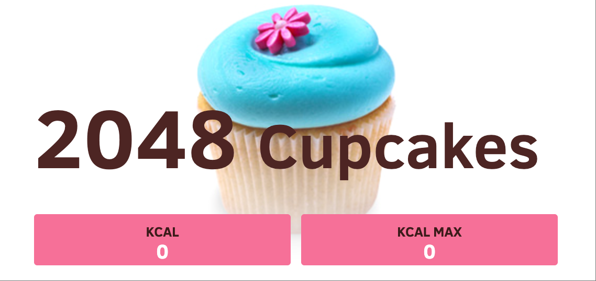
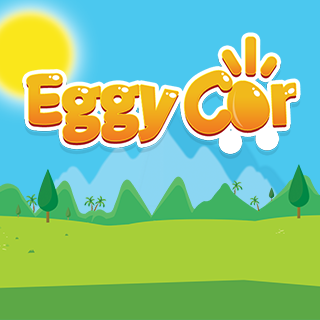
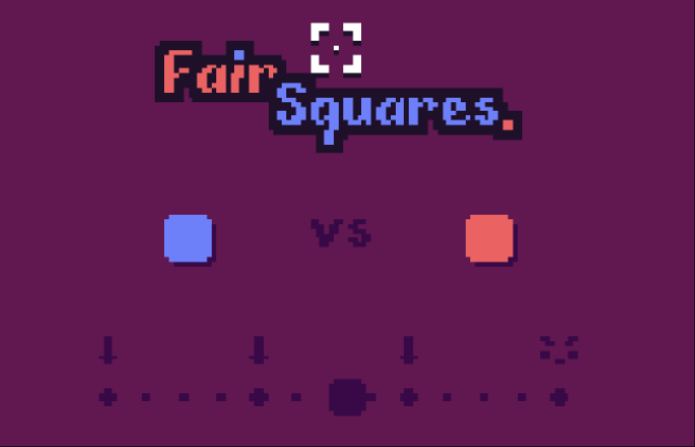
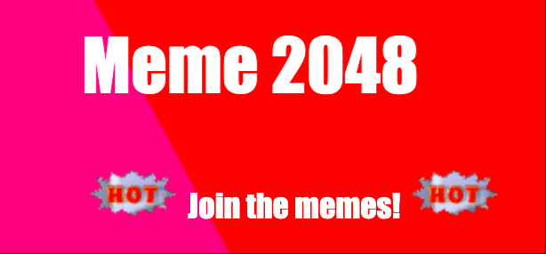
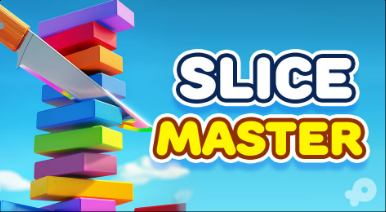
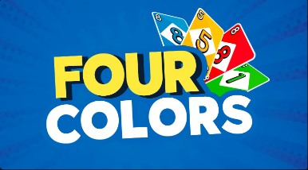

# 🎮 Collection de Jeux H5 Open Source

*🌍 Languages: [English](README.md) | [中文简体](README-zh.md) | [日本語](README-ja.md) | [Deutsch](README-de.md) | **Français***

<!-- Script de changement de langue -->
<script>
function switchLanguage(lang) {
    const languageFiles = {
        'en': 'README.md',
        'zh': 'README-zh.md',
        'ja': 'README-ja.md',
        'de': 'README-de.md',
        'fr': 'README-fr.md'
    };
    if (languageFiles[lang]) {
        window.location.href = languageFiles[lang];
    }
}
</script>

<!-- Compteur de statistiques -->
<div align="center">
    
    
    
</div>

---

## 📊 Statistiques

- **Nombre total de jeux**: 22
- **Catégories de jeux**: Puzzle, Action, Arcade, Stratégie
- **Langues supportées**: 5
- **Prêt à jouer**: ✅ Tous les jeux

---

Bienvenue dans notre collection de jeux HTML5 open source ! Chaque jeu peut être exécuté directement dans votre navigateur et est livré avec un code source complet.

### 🎯 Liste des Jeux

| Jeu | Logo | Jouer en Ligne | Catégorie |
|-----|------|----------------|-----------|
| 2048 |  | [Jouer Maintenant](https://cubes-2048.io/games/2048) | Puzzle |
| 2048 Multitâche |  | [Jouer Maintenant](https://cubes-2048.io/games/2048-multitask) | Puzzle |
| Cubes 2048 |  | [Jouer Maintenant](https://cubes-2048.io/games/cubes-2048) | Puzzle |
| Cupcake 2048 |  | [Jouer Maintenant](https://cubes-2048.io/games/cupcake2048) | Puzzle |
| Doge 2048 |  | [Jouer Maintenant](https://cubes-2048.io/games/doge2048) | Puzzle |
| Drive Mad |  | [Jouer Maintenant](https://cubes-2048.io/games/drive-mad) | Action |
| Edge Surf |  | [Jouer Maintenant](https://cubes-2048.io/games/edge-surf) | Action |
| Eggy Car |  | [Jouer Maintenant](https://cubes-2048.io/games/eggycar) | Action |
| Fair Squares |  | [Jouer Maintenant](https://cubes-2048.io/games/fairsquares) | Puzzle |
| Fancy Pants Adventures |  | [Jouer Maintenant](https://cubes-2048.io/games/fancypantsadventures) | Action |
| Fantasy Dash |  | [Jouer Maintenant](https://cubes-2048.io/games/fantasy-dash) | Action |
| Flappy Bird |  | [Jouer Maintenant](https://cubes-2048.io/games/flappy-bird) | Arcade |
| Flappy Bird (Alternative) |  | [Jouer Maintenant](https://cubes-2048.io/games/flappybird) | Arcade |
| Flash Tetris |  | [Jouer Maintenant](https://cubes-2048.io/games/flashtetris) | Puzzle |
| Game Inside |  | [Jouer Maintenant](https://cubes-2048.io/games/game-inside) | Arcade |
| Geo Dash |  | [Jouer Maintenant](https://cubes-2048.io/games/geodash) | Action |
| Bonne Nuit |  | [Jouer Maintenant](https://cubes-2048.io/games/goodnight) | Arcade |
| Meme 2048 |  | [Jouer Maintenant](https://cubes-2048.io/games/meme2048) | Puzzle |
| Poly Track |  | [Jouer Maintenant](https://cubes-2048.io/games/polytrack) | Action |
| Slice Master |  | [Jouer Maintenant](https://cubes-2048.io/games/slice-master) | Arcade |
| Spider FRVR |  | [Jouer Maintenant](https://cubes-2048.io/games/spiderfrvr) | Stratégie |
| UNO Online |  | [Jouer Maintenant](https://cubes-2048.io/games/uno-online) | Stratégie |

### 🚀 Commencer

1. **Clonez ce dépôt**
   ```bash
   git clone https://github.com/ailingqu/h5games.git
   ```

2. **Naviguez vers n'importe quel répertoire de jeu**
   ```bash
   cd h5games/[nom-du-jeu]
   ```

3. **Ouvrez le fichier `index.html` dans votre navigateur**
   ```bash
   open index.html
   ```

4. **Commencez à jouer !**

### 💻 Développement

Chaque jeu comprend :
- ✅ Code source HTML5 complet
- ✅ Fichiers de style CSS
- ✅ Logique de jeu JavaScript
- ✅ Assets et ressources
- ✅ Configuration prête à l'emploi

### 📈 Analytique

<!-- Analytique des jeux -->
<script>
// Suivi des clics sur les jeux
function trackGameClick(gameName) {
    if (typeof gtag !== 'undefined') {
        gtag('event', 'game_click', {
            'game_name': gameName,
            'event_category': 'games',
            'event_label': gameName
        });
    }
}

// Suivi du changement de langue
function trackLanguageSwitch(language) {
    if (typeof gtag !== 'undefined') {
        gtag('event', 'language_switch', {
            'language': language,
            'event_category': 'navigation',
            'event_label': language
        });
    }
}
</script>

### 📜 Licence

Tous les jeux sont open source et disponibles pour un usage éducatif et personnel. Veuillez vérifier les répertoires de jeux individuels pour des informations de licence spécifiques.

### 🤝 Contribution

Nous accueillons les contributions ! N'hésitez pas à :
- 🐛 Signaler des bugs
- 💡 Suggérer de nouvelles fonctionnalités
- 🎮 Ajouter de nouveaux jeux
- 🌍 Améliorer les traductions
- 📚 Enrichir la documentation

### 📞 Support

Si vous rencontrez des problèmes ou avez des questions, veuillez [créer un issue](https://github.com/ailingqu/h5games/issues) sur GitHub.

### ⚠️ Avis de droits d'auteur

Tous les jeux de cette collection ont été collectés sur Internet à des fins éducatives et de divertissement. Si vous êtes le détenteur des droits d'auteur d'un jeu et souhaitez qu'il soit supprimé, veuillez nous contacter et nous le supprimerons immédiatement.

---

<div align="center">
    <strong>⭐ Si vous aimez ce projet, merci de nous donner une étoile ! ⭐</strong>
    <br><br>
    <strong>🎮 Amusez-vous bien ! 🎮</strong>
</div> 