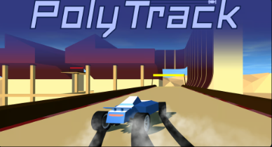

# 🎮 Collection de Jeux H5 Open Source

*🌍 Languages: [English](README.md) | [中文简体](README-zh.md) | [日本語](README-ja.md) | [Deutsch](README-de.md) | **Français***

<!-- Script de changement de langue -->
<script>
function switchLanguage(lang) {
    const languageFiles = {
        'en': 'README.md',
        'zh': 'README-zh.md',
        'ja': 'README-ja.md',
        'de': 'README-de.md',
        'fr': 'README-fr.md'
    };
    if (languageFiles[lang]) {
        window.location.href = languageFiles[lang];
    }
}
</script>

<!-- Compteur de statistiques -->
<div align="center">
    
    
    
</div>

---

## 📊 Statistiques

- **Nombre total de jeux**: 22
- **Catégories de jeux**: Puzzle, Action, Arcade, Stratégie
- **Langues supportées**: 5
- **Prêt à jouer**: ✅ Tous les jeux

---

Bienvenue dans notre collection de jeux HTML5 open source ! Chaque jeu peut être exécuté directement dans votre navigateur et est livré avec un code source complet.

### 🎯 Liste des Jeux

| Jeu | Logo | Jouer en Ligne | Catégorie |
|-----|------|----------------|-----------|
| [2048](./2048/) |  | [Jouer Maintenant](https://cubes-2048.io/games/2048) | Puzzle |
| [2048 Multitâche](./2048-Multitask/) |  | [Jouer Maintenant](https://cubes-2048.io/games/2048-Multitask) | Puzzle |
| [Cubes 2048](./cubes-2048/) |  | [Jouer Maintenant](https://cubes-2048.io/games/cubes-2048) | Puzzle |
| [Cupcake 2048](./Cupcake-2048/) |  | [Jouer Maintenant](https://cubes-2048.io/games/Cupcake-2048) | Puzzle |
| [Doge 2048](./Doge-2048/) |  | [Jouer Maintenant](https://cubes-2048.io/games/Doge-2048) | Puzzle |
| [Drive Mad](./Drive-Mad/) |  | [Jouer Maintenant](https://cubes-2048.io/games/Drive-Mad) | Action |
| [Edge Surf](./Edge-Surf/) |  | [Jouer Maintenant](https://cubes-2048.io/games/Edge-Surf) | Action |
| [Eggy Car](./Eggy-Car/) |  | [Jouer Maintenant](https://cubes-2048.io/games/Eggy-Car) | Action |
| [Fair Squares](./Fair-Squares/) |  | [Jouer Maintenant](https://cubes-2048.io/games/Fair-Squares) | Puzzle |
| [Fancy Pants Adventures](./Fancy-Pants-Adventures/) |  | [Jouer Maintenant](https://cubes-2048.io/games/Fancy-Pants-Adventures) | Action |
| [Fantasy Dash](./Fantasy-Dash/) |  | [Jouer Maintenant](https://cubes-2048.io/games/Fantasy-Dash) | Action |
| [Flappy Bird](./Flappy-Bird/) |  | [Jouer Maintenant](https://cubes-2048.io/games/Flappy-Bird) | Arcade |
| [Flappy Bird (Alternative)](./FlappyBird/) |  | [Jouer Maintenant](https://cubes-2048.io/games/FlappyBird) | Arcade |
| [Flash Tetris](./Flash-Tetris/) |  | [Jouer Maintenant](https://cubes-2048.io/games/Flash-Tetris) | Puzzle |
| [Game Inside](./Game-Inside/) |  | [Jouer Maintenant](https://cubes-2048.io/games/Game-Inside) | Arcade |
| [Geo Dash](./GeoDash/) |  | [Jouer Maintenant](https://cubes-2048.io/games/GeoDash) | Action |
| [Bonne Nuit](./Goodnight/) |  | [Jouer Maintenant](https://cubes-2048.io/games/Goodnight) | Arcade |
| [Meme 2048](./Meme-2048/) |  | [Jouer Maintenant](https://cubes-2048.io/games/Meme-2048) | Puzzle |
| [Poly Track](./polytrack/) |  | [Jouer Maintenant](https://cubes-2048.io/games/polytrack) | Action |
| [Slice Master](./slicemaster/) |  | [Jouer Maintenant](https://cubes-2048.io/games/slicemaster) | Arcade |
| [Spider FRVR](./spiderfrvr/) |  | [Jouer Maintenant](https://cubes-2048.io/games/spiderfrvr) | Stratégie |
| [UNO Online](./unoonline/) |  | [Jouer Maintenant](https://cubes-2048.io/games/unoonline) | Stratégie |

### 🚀 Commencer

1. **Clonez ce dépôt**
   ```bash
   git clone https://github.com/ailingqu/h5games.git
   ```

2. **Naviguez vers n'importe quel répertoire de jeu**
   ```bash
   cd h5games/[nom-du-jeu]
   ```

3. **Ouvrez le fichier `index.html` dans votre navigateur**
   ```bash
   open index.html
   ```

4. **Commencez à jouer !**

### 💻 Développement

Chaque jeu comprend :
- ✅ Code source HTML5 complet
- ✅ Fichiers de style CSS
- ✅ Logique de jeu JavaScript
- ✅ Assets et ressources
- ✅ Configuration prête à l'emploi

### 📈 Analytique

<!-- Analytique des jeux -->
<script>
// Suivi des clics sur les jeux
function trackGameClick(gameName) {
    if (typeof gtag !== 'undefined') {
        gtag('event', 'game_click', {
            'game_name': gameName,
            'event_category': 'games',
            'event_label': gameName
        });
    }
}

// Suivi du changement de langue
function trackLanguageSwitch(language) {
    if (typeof gtag !== 'undefined') {
        gtag('event', 'language_switch', {
            'language': language,
            'event_category': 'navigation',
            'event_label': language
        });
    }
}
</script>

### 📜 Licence

Tous les jeux sont open source et disponibles pour un usage éducatif et personnel. Veuillez vérifier les répertoires de jeux individuels pour des informations de licence spécifiques.

### 🤝 Contribution

Nous accueillons les contributions ! N'hésitez pas à :
- 🐛 Signaler des bugs
- 💡 Suggérer de nouvelles fonctionnalités
- 🎮 Ajouter de nouveaux jeux
- 🌍 Améliorer les traductions
- 📚 Enrichir la documentation

### 📞 Support

Si vous rencontrez des problèmes ou avez des questions, veuillez [créer un issue](https://github.com/ailingqu/h5games/issues) sur GitHub.

### ⚠️ Avis de droits d'auteur

Tous les jeux de cette collection ont été collectés sur Internet à des fins éducatives et de divertissement. Si vous êtes le détenteur des droits d'auteur d'un jeu et souhaitez qu'il soit supprimé, veuillez nous contacter et nous le supprimerons immédiatement.

---

<div align="center">
    <strong>⭐ Si vous aimez ce projet, merci de nous donner une étoile ! ⭐</strong>
    <br><br>
    <strong>🎮 Amusez-vous bien ! 🎮</strong>
</div> 