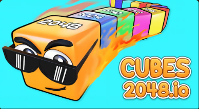
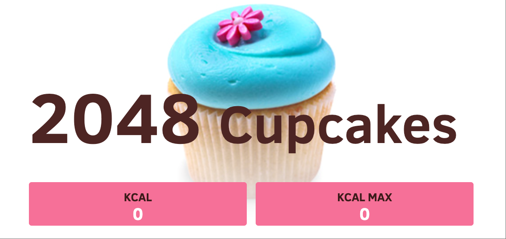
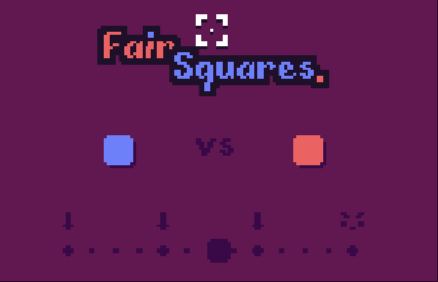
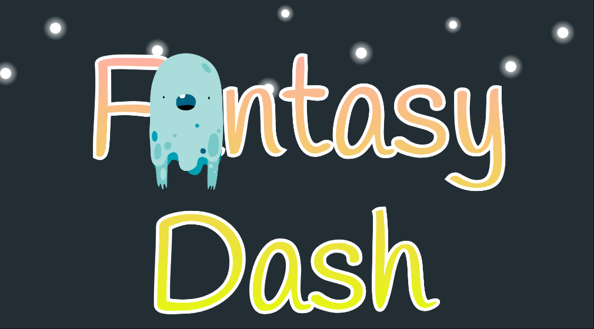
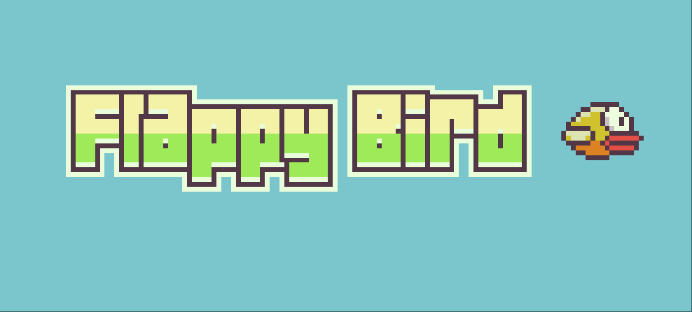
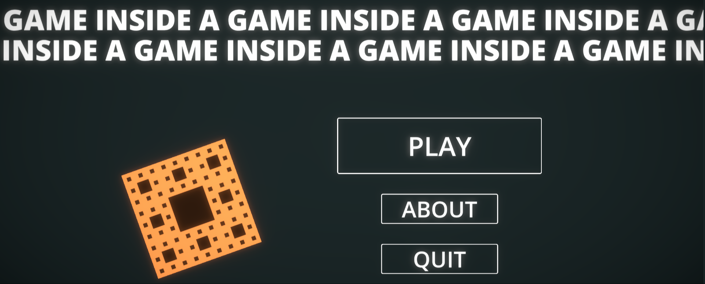
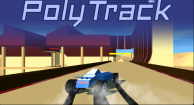
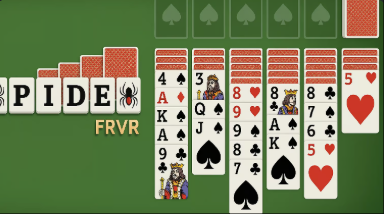

# 🎮 オープンソースH5ゲームコレクション

*🌍 Languages: [English](README.md) | [中文简体](README-zh.md) | **日本語** | [Deutsch](README-de.md) | [Français](README-fr.md)*


<!-- 統計カウンター -->
<div align="center">
    
    
    
</div>

---

## 📊 統計データ

- **総ゲーム数**: 22個
- **ゲームカテゴリ**: パズル、アクション、アーケード、ストラテジー
- **対応言語**: 5言語
- **即座にプレイ可能**: ✅ 全ゲーム

---

オープンソースHTML5ゲームコレクションへようこそ！各ゲームはブラウザで直接実行でき、完全なソースコードが付属しています。

### 🎯 ゲームリスト

| ゲーム | ロゴ | オンラインプレイ | カテゴリ |
|--------|------|------------------|----------|
| [2048](./2048/) |  | [今すぐプレイ](https://cubes-2048.io/games/2048) | パズル |
| [2048マルチタスク](./2048-Multitask/) |  | [今すぐプレイ](https://cubes-2048.io/games/2048-Multitask) | パズル |
| [キューブ2048](./cubes-2048/) |  | [今すぐプレイ](https://cubes-2048.io/games/cubes-2048) | パズル |
| [カップケーキ2048](./Cupcake-2048/) |  | [今すぐプレイ](https://cubes-2048.io/games/Cupcake-2048) | パズル |
| [ドージ2048](./Doge-2048/) |  | [今すぐプレイ](https://cubes-2048.io/games/Doge-2048) | パズル |
| [ドライブマッド](./Drive-Mad/) |  | [今すぐプレイ](https://cubes-2048.io/games/Drive-Mad) | アクション |
| [エッジサーフ](./Edge-Surf/) |  | [今すぐプレイ](https://cubes-2048.io/games/Edge-Surf) | アクション |
| [エッギーカー](./Eggy-Car/) |  | [今すぐプレイ](https://cubes-2048.io/games/Eggy-Car) | アクション |
| [フェアスクエア](./Fair-Squares/) |  | [今すぐプレイ](https://cubes-2048.io/games/Fair-Squares) | パズル |
| [ファンシーパンツアドベンチャー](./Fancy-Pants-Adventures/) |  | [今すぐプレイ](https://cubes-2048.io/games/Fancy-Pants-Adventures) | アクション |
| [ファンタジーダッシュ](./Fantasy-Dash/) |  | [今すぐプレイ](https://cubes-2048.io/games/Fantasy-Dash) | アクション |
| [フラッピーバード](./Flappy-Bird/) |  | [今すぐプレイ](https://cubes-2048.io/games/Flappy-Bird) | アーケード |
| [フラッピーバード（代替版）](./FlappyBird/) |  | [今すぐプレイ](https://cubes-2048.io/games/FlappyBird) | アーケード |
| [フラッシュテトリス](./Flash-Tetris/) |  | [今すぐプレイ](https://cubes-2048.io/games/Flash-Tetris) | パズル |
| [ゲームインサイド](./Game-Inside/) |  | [今すぐプレイ](https://cubes-2048.io/games/Game-Inside) | アーケード |
| [ジオダッシュ](./GeoDash/) |  | [今すぐプレイ](https://cubes-2048.io/games/GeoDash) | アクション |
| [おやすみ](./Goodnight/) |  | [今すぐプレイ](https://cubes-2048.io/games/Goodnight) | アーケード |
| [ミーム2048](./Meme-2048/) |  | [今すぐプレイ](https://cubes-2048.io/games/Meme-2048) | パズル |
| [ポリトラック](./polytrack/) |  | [今すぐプレイ](https://cubes-2048.io/games/polytrack) | アクション |
| [スライスマスター](./slicemaster/) |  | [今すぐプレイ](https://cubes-2048.io/games/slicemaster) | アーケード |
| [スパイダーFRVR](./spiderfrvr/) |  | [今すぐプレイ](https://cubes-2048.io/games/spiderfrvr) | ストラテジー |
| [UNOオンライン](./unoonline/) |  | [今すぐプレイ](https://cubes-2048.io/games/unoonline) | ストラテジー |

### 🚀 はじめに

1. **このリポジトリをクローンする**
   ```bash
   git clone https://github.com/ailingqu/h5games.git
   ```

2. **任意のゲームディレクトリに移動する**
   ```bash
   cd h5games/[ゲーム名]
   ```

3. **ゲームを実行する**（以下のいずれかの方法を選択）：

   **方法1：ブラウザで直接開く（シンプルゲーム）**
   ```bash
   # Web環境を必要としないシンプルなゲーム用
   open index.html
   ```

   **方法2：ローカルWebサーバーを起動する（推奨）**
   ```bash
   # Python（Python 3）を使用
   python -m http.server 8000
   # その後、ブラウザで http://localhost:8000 を開く
   
   # Python（Python 2）を使用
   python -m SimpleHTTPServer 8000
   
   # Node.js（npxがインストールされている場合）を使用
   npx http-server -p 8000
   
   # PHP（PHPがインストールされている場合）を使用
   php -S localhost:8000
   ```

   **方法3：Live Server（VS Code拡張機能）**
   ```bash
   # VS CodeでLive Server拡張機能をインストール
   # index.htmlファイルを右クリックして「Open with Live Server」を選択
   ```

4. **プレイ開始！**

> **⚠️ 重要**：一部のゲームは、CORS制限やファイル読み込み要件により、Webサーバー環境での実行が必要です。index.htmlファイルを直接開いても動作しない場合は、上記の方法2または3をご使用ください。

### 💻 開発

各ゲームには以下が含まれています：
- ✅ 完全なHTML5ソースコード
- ✅ CSSスタイルファイル
- ✅ JavaScriptゲームロジック
- ✅ アセットとリソース
- ✅ すぐに実行できる設定

### 📈 アナリティクス

このリポジトリには、使用統計と人気ゲームのモニタリングのためのアナリティクス追跡機能が含まれています。

### 📜 ライセンス

すべてのゲームはオープンソースであり、教育および個人利用が可能です。具体的なライセンス情報については、各ゲームディレクトリを確認してください。

### 🤝 貢献

貢献を歓迎します！お気軽に：
- 🐛 バグレポート
- 💡 新機能の提案
- 🎮 新ゲームの追加
- 🌍 翻訳の改善
- 📚 ドキュメントの強化

### 📞 サポート

問題が発生した場合やご質問がある場合は、GitHub上で[イシューを作成](https://github.com/ailingqu/h5games/issues)してください。

### ⚠️ 著作権に関する注意

このコレクションに含まれるすべてのゲームは、教育および娯楽目的でインターネットから収集されています。ゲームの著作権者の方で削除をご希望の場合は、ご連絡いただければ直ちに削除いたします。

---

<div align="center">
    <strong>⭐ このプロジェクトを気に入ったら、ぜひスターを付けてください！ ⭐</strong>
    <br><br>
    <strong>🎮 楽しいゲームライフを！ 🎮</strong>
</div> 