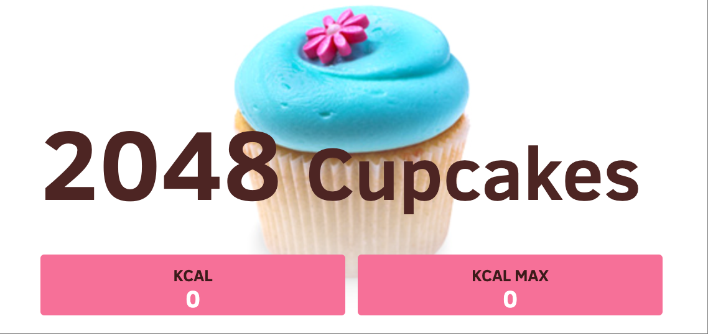

# 🎮 开源H5游戏合集

*🌍 Languages: [English](README.md) | **中文简体** | [日本語](README-ja.md) | [Deutsch](README-de.md) | [Français](README-fr.md)*


<!-- 统计计数器 -->
<div align="center">
    
    
    
</div>

---

## 📊 统计数据

- **游戏总数**: 22个
- **游戏分类**: 益智、动作、街机、策略
- **支持语言**: 5种
- **即时可玩**: ✅ 所有游戏

---

欢迎来到我们的开源HTML5游戏合集！每个游戏都可以直接在浏览器中运行，并提供完整的源代码。

### 🎯 游戏列表

| 游戏 | 图标 | 在线游玩 | 分类 |
|------|------|----------|------|
| [2048](./2048/) |  | [立即游玩](https://cubes-2048.io/games/2048) | 益智 |
| [2048多任务版](./2048-Multitask/) |  | [立即游玩](https://cubes-2048.io/games/2048-Multitask) | 益智 |
| [方块2048](./cubes-2048/) |  | [立即游玩](https://cubes-2048.io/games/cubes-2048) | 益智 |
| [纸杯蛋糕2048](./Cupcake-2048/) |  | [立即游玩](https://cubes-2048.io/games/Cupcake-2048) | 益智 |
| [总督2048](./Doge-2048/) |  | [立即游玩](https://cubes-2048.io/games/Doge-2048) | 益智 |
| [疯狂驾驶](./Drive-Mad/) |  | [立即游玩](https://cubes-2048.io/games/Drive-Mad) | 动作 |
| [边缘冲浪](./Edge-Surf/) |  | [立即游玩](https://cubes-2048.io/games/Edge-Surf) | 动作 |
| [鸡蛋车](./Eggy-Car/) |  | [立即游玩](https://cubes-2048.io/games/Eggy-Car) | 动作 |
| [公平方块](./Fair-Squares/) |  | [立即游玩](https://cubes-2048.io/games/Fair-Squares) | 益智 |
| [奇幻裤子冒险](./Fancy-Pants-Adventures/) |  | [立即游玩](https://cubes-2048.io/games/Fancy-Pants-Adventures) | 动作 |
| [奇幻冲刺](./Fantasy-Dash/) |  | [立即游玩](https://cubes-2048.io/games/Fantasy-Dash) | 动作 |
| [飞翔的小鸟](./Flappy-Bird/) |  | [立即游玩](https://cubes-2048.io/games/Flappy-Bird) | 街机 |
| [飞翔的小鸟（备用版）](./FlappyBird/) |  | [立即游玩](https://cubes-2048.io/games/FlappyBird) | 街机 |
| [闪光俄罗斯方块](./Flash-Tetris/) |  | [立即游玩](https://cubes-2048.io/games/Flash-Tetris) | 益智 |
| [游戏中的游戏](./Game-Inside/) |  | [立即游玩](https://cubes-2048.io/games/Game-Inside) | 街机 |
| [几何冲刺](./GeoDash/) |  | [立即游玩](https://cubes-2048.io/games/GeoDash) | 动作 |
| [晚安](./Goodnight/) |  | [立即游玩](https://cubes-2048.io/games/Goodnight) | 街机 |
| [表情包2048](./Meme-2048/) |  | [立即游玩](https://cubes-2048.io/games/Meme-2048) | 益智 |
| [多边形赛道](./polytrack/) |  | [立即游玩](https://cubes-2048.io/games/polytrack) | 动作 |
| [切片大师](./slicemaster/) |  | [立即游玩](https://cubes-2048.io/games/slicemaster) | 街机 |
| [蜘蛛纸牌](./spiderfrvr/) |  | [立即游玩](https://cubes-2048.io/games/spiderfrvr) | 策略 |
| [UNO在线](./unoonline/) |  | [立即游玩](https://cubes-2048.io/games/unoonline) | 策略 |

### 🚀 开始使用

1. **克隆此仓库**
   ```bash
   git clone https://github.com/ailingqu/h5games.git
   ```

2. **进入任意游戏目录**
   ```bash
   cd h5games/[游戏名称]
   ```

3. **运行游戏**（选择以下任一方法）：

   **方法1：直接在浏览器中打开（简单游戏）**
   ```bash
   # 适用于不需要web环境的简单游戏
   open index.html
   ```

   **方法2：启动本地Web服务器（推荐）**
   ```bash
   # 使用Python（Python 3）
   python -m http.server 8000
   # 然后在浏览器中打开 http://localhost:8000
   
   # 使用Python（Python 2）
   python -m SimpleHTTPServer 8000
   
   # 使用Node.js（如果安装了npx）
   npx http-server -p 8000
   
   # 使用PHP（如果安装了PHP）
   php -S localhost:8000
   ```

   **方法3：Live Server（VS Code扩展）**
   ```bash
   # 在VS Code中安装Live Server扩展
   # 右键点击index.html文件，选择"Open with Live Server"
   ```

4. **开始游戏！**

> **⚠️ 重要提示**：某些游戏由于CORS限制或文件加载要求，需要在Web服务器环境中运行。如果直接打开index.html文件无法正常运行，请使用上述方法2或方法3。

### 💻 开发

每个游戏都包含：
- ✅ 完整的HTML5源代码
- ✅ CSS样式文件
- ✅ JavaScript游戏逻辑
- ✅ 资源和素材
- ✅ 开箱即用的配置

### 📈 数据分析

本仓库包含数据分析跟踪功能，用于统计使用情况和热门游戏监控。

### 📜 许可证

所有游戏都是开源的，可用于教育和个人用途。请检查各个游戏目录以获取具体的许可证信息。

### 🤝 贡献

欢迎贡献！请随时：
- 🐛 报告错误
- 💡 建议新功能
- 🎮 添加新游戏
- 🌍 改进翻译
- 📚 增强文档

### 📞 技术支持

如果您遇到任何问题或有疑问，请在GitHub上[提交问题](https://github.com/ailingqu/h5games/issues)。
[contact Cal](https://cal.com/2048-cubes)

### ⚠️ 版权声明

本合集中的所有游戏均从网络上收集，仅用于教育和娱乐目的。如果您是任何游戏的版权持有者并希望将其删除，请联系我们，我们会立即删除。

---

<div align="center">
    <strong>⭐ 如果您喜欢这个项目，请给我们一个星标！ ⭐</strong>
    <br><br>
    <strong>🎮 祝您游戏愉快！ 🎮</strong>
</div> 