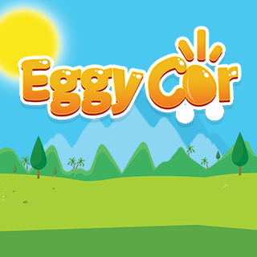

# 🎮 Open Source H5 Games Collection

*🌍 Languages: **English** | [中文简体](README-zh.md) | [日本語](README-ja.md) | [Deutsch](README-de.md) | [Français](README-fr.md)*

<!-- Language Switch Script -->
<script>
function switchLanguage(lang) {
    const languageFiles = {
        'en': 'README.md',
        'zh': 'README-zh.md',
        'ja': 'README-ja.md',
        'de': 'README-de.md',
        'fr': 'README-fr.md'
    };
    if (languageFiles[lang]) {
        window.location.href = languageFiles[lang];
    }
}
</script>

<!-- Stats Counter -->
<div align="center">
    
    
    
</div>

---

## 📊 Statistics

- **Total Games**: 22
- **Game Categories**: Puzzle, Action, Arcade, Strategy
- **Languages Supported**: 5
- **Ready to Play**: ✅ All games

---

Welcome to our collection of open-source HTML5 games! Each game is ready to run directly in your browser and comes with complete source code.

### 🎯 Games List

| Game | Logo | Play Online | Category |
|------|------|-------------|----------|
| [2048](./2048/) |  | [Play Now](https://cubes-2048.io/games/2048) | Puzzle |
| [2048 Multitask](./2048-Multitask/) |  | [Play Now](https://cubes-2048.io/games/2048-Multitask) | Puzzle |
| [Cubes 2048](./cubes-2048/) |  | [Play Now](https://cubes-2048.io/games/cubes-2048) | Puzzle |
| [Cupcake 2048](./Cupcake-2048/) |  | [Play Now](https://cubes-2048.io/games/Cupcake-2048) | Puzzle |
| [Doge 2048](./Doge-2048/) |  | [Play Now](https://cubes-2048.io/games/Doge-2048) | Puzzle |
| [Drive Mad](./Drive-Mad/) |  | [Play Now](https://cubes-2048.io/games/Drive-Mad) | Action |
| [Edge Surf](./Edge-Surf/) |  | [Play Now](https://cubes-2048.io/games/Edge-Surf) | Action |
| [Eggy Car](./Eggy-Car/) |  | [Play Now](https://cubes-2048.io/games/Eggy-Car) | Action |
| [Fair Squares](./Fair-Squares/) |  | [Play Now](https://cubes-2048.io/games/Fair-Squares) | Puzzle |
| [Fancy Pants Adventures](./Fancy-Pants-Adventures/) |  | [Play Now](https://cubes-2048.io/games/Fancy-Pants-Adventures) | Action |
| [Fantasy Dash](./Fantasy-Dash/) |  | [Play Now](https://cubes-2048.io/games/Fantasy-Dash) | Action |
| [Flappy Bird](./Flappy-Bird/) |  | [Play Now](https://cubes-2048.io/games/Flappy-Bird) | Arcade |
| [Flappy Bird (Alternative)](./FlappyBird/) |  | [Play Now](https://cubes-2048.io/games/FlappyBird) | Arcade |
| [Flash Tetris](./Flash-Tetris/) |  | [Play Now](https://cubes-2048.io/games/Flash-Tetris) | Puzzle |
| [Game Inside](./Game-Inside/) |  | [Play Now](https://cubes-2048.io/games/Game-Inside) | Arcade |
| [Geo Dash](./GeoDash/) |  | [Play Now](https://cubes-2048.io/games/GeoDash) | Action |
| [Good Night](./Goodnight/) |  | [Play Now](https://cubes-2048.io/games/Goodnight) | Arcade |
| [Meme 2048](./Meme-2048/) |  | [Play Now](https://cubes-2048.io/games/Meme-2048) | Puzzle |
| [Poly Track](./polytrack/) |  | [Play Now](https://cubes-2048.io/games/polytrack) | Action |
| [Slice Master](./slicemaster/) |  | [Play Now](https://cubes-2048.io/games/slicemaster) | Arcade |
| [Spider FRVR](./spiderfrvr/) |  | [Play Now](https://cubes-2048.io/games/spiderfrvr) | Strategy |
| [UNO Online](./unoonline/) |  | [Play Now](https://cubes-2048.io/games/unoonline) | Strategy |

### 🚀 Getting Started

1. **Clone this repository**
   ```bash
   git clone https://github.com/ailingqu/h5games.git
   ```

2. **Navigate to any game directory**
   ```bash
   cd h5games/[game-name]
   ```

3. **Open the `index.html` file in your browser**
   ```bash
   open index.html
   ```

4. **Start playing!**

### 💻 Development

Each game comes with:
- ✅ Complete HTML5 source code
- ✅ CSS styling files
- ✅ JavaScript game logic
- ✅ Assets and resources
- ✅ Ready-to-run configuration

### 📈 Analytics

<!-- Game Analytics -->
<script>
// Game click tracking
function trackGameClick(gameName) {
    if (typeof gtag !== 'undefined') {
        gtag('event', 'game_click', {
            'game_name': gameName,
            'event_category': 'games',
            'event_label': gameName
        });
    }
}

// Language switch tracking
function trackLanguageSwitch(language) {
    if (typeof gtag !== 'undefined') {
        gtag('event', 'language_switch', {
            'language': language,
            'event_category': 'navigation',
            'event_label': language
        });
    }
}
</script>

### 📜 License

All games are open source and available for educational and personal use. Please check individual game directories for specific license information.

### 🤝 Contributing

We welcome contributions! Please feel free to:
- 🐛 Report bugs
- 💡 Suggest new features
- 🎮 Add new games
- 🌍 Improve translations
- 📚 Enhance documentation

### 📞 Support

If you encounter any issues or have questions, please [open an issue](https://github.com/ailingqu/h5games/issues) on GitHub.

### ⚠️ Copyright Notice

All games in this collection are gathered from the internet for educational and entertainment purposes. If you are the copyright holder of any game and wish to have it removed, please contact us and we will remove it immediately.

---

<div align="center">
    <strong>⭐ If you like this project, please give it a star! ⭐</strong>
    <br><br>
    <strong>🎮 Happy Gaming! 🎮</strong>
</div> 